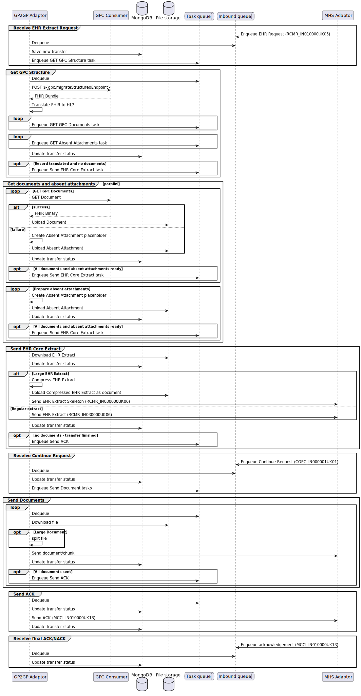

# GP2GP Sending Adaptor 

National Integration Adaptor - [GP2GP Sending Adaptor](https://digital.nhs.uk/developer/api-catalogue/gp2gp/gp2gp-sending-adaptor)

The existing GP2GP solution uses a legacy messaging standard and infrastructure (HL7v3 and Spine TMS). Reliance
on these standards going forward presents a significant barrier to successful GP2GP implementation by new suppliers,
and perpetuation of these standards in the long term presents a risk to the continued operation of GP2GP across all
suppliers.

A hybrid solution approach has been selected as the best option for GP2GP adoption by NMEs and transition by existing
incumbent suppliers.

The "National Integration Adaptor - GP2GP" implements a GP2GP 2.2b producer using the supplier's existing GP Connect
Provider implementation to extract the Electronic Health Record. Suppliers that have not already implemented a
GP2GP 2.2b producer, or those wishing to decommission their existing producer, may deploy the GP2GP adaptor in its place.

## Table of contents

1. [Guidance for setting up the GP2GP adaptors in INT](https://github.com/NHSDigital/nia-patient-switching-standard-adaptor/blob/main/getting-started-instructions.md)
1. [Guidance for operating the adaptor as a New Market Entrant](OPERATING.md)
1. [Guidance on integrating with the adaptors APIs](#adaptor-api)
1. [Documentation on how this adaptor maps GPConnect concepts to GP2GP concepts](https://github.com/NHSDigital/patient-switching-adaptors-mapping-documentation)

## Adaptor API

An API is provided to query the status of GP2GP transfers that have been processed, and initiate a resend of an
Electronic Health Record which has failed to transfer.

The API has been [documented using the OpenAPI Specification (version 3.0.1)](gp2gp_adaptor_response_docs.yaml) and
includes detailed descriptions of endpoints, parameters, and data models, as well as examples of requests and responses
to help developers integrate and use the API effectively.

The documentation can also be displayed using [editor.swagger.io (exteral link)][swagger_editor].

[swagger_editor]: https://editor.swagger.io/?url=https://raw.githubusercontent.com/NHSDigital/integration-adaptor-gp2gp-sending/refs/heads/main/gp2gp_adaptor_response_docs.yaml

## Diagrams

### Sequence Diagram

## NIA Support (NHS England) guidance

If you are are New Market Entrant, please read the guidance linked from the [table of contents](#table-of-contents).
If you are looking to make changes to the adaptor you should first read the [guidance for developing the adaptor](nhs-england-developer-information.md).

## Disclaimer

All Patient data within this repository is synthetic

## Licensing
This code is dual licensed under the MIT license and the OGL (Open Government License). Any new work added to this repository must conform to the conditions of these licenses. In particular this means that this project may not depend on GPL-licensed or AGPL-licensed libraries, as these would violate the terms of those libraries' licenses.

The contents of this repository are protected by Crown Copyright (C).