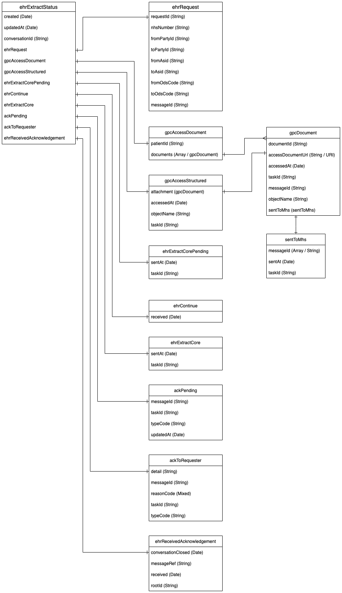

# Database Objects

## EHR Extract Status

| Field Name                 | Datatype | Constraints                                                  |
| -------------------------- | -------- | ------------------------------------------------------------ |
| created                    | Date     | N/A                                                          |
| updatedAt                  | Date     | N/A                                                          |
| conversationId             | String   | UUID V4                                                      |
| ehrRequest                 | Object   | [EHR Request](database.md#ehr-request)                       |
| gpcAccessDocument          | Object   | [GPC Access Document](database.md#gpc-access-document)       |
| gpcAccessStructured        | Object   | [GPC Access Structured](database.md#gpc-access-structured)   |
| ehrExtractCorePending      | Object   | [EHR Extract Core Pending](database.md#ehr-extract-core-pending) |
| ehrContrinue               | Object   | [EHR Continue](database.md#ehr-continue)                     |
| ehrExtractCore             | Object   | [EHR Extract Core](database.md#ehr-extract-core)             |
| ackPending                 | Object   | [ACK Pending](database.md#ack-pending)                       |
| ackToRequester             | Object   | [ACK To Requester](database.md#ack-to-requester)             |
| ehrReceivedAcknowledgement | Object   | [EHR Receieved Acknowledgement](database.md#ehr-received-acknowledgement) |

## EHR Request

| Field Name  | Datatype | Constraints |
| ----------- | -------- | ----------- |
| requestId   | String   | UUID V4     |
| nhsNumber   | String   | NHS Number  |
| fromPartyId | String   | N/A         |
| toPartyId   | String   | N/A         |
| fromAsid    | String   | N/A         |
| toAsid      | String   | N/A         |
| fromOdsCode | String   | N/A         |
| toOdsCode   | String   | N/A         |
| messageId   | String   | UUID V4     |

## GPC Access Document

| Field Name | Datatype       | Constraints                              |
| ---------- | -------------- | ---------------------------------------- |
| patientId  | String         | N/A                                      |
| documents  | Object (Array) | [GPC Document](database.md#gpc-document) |

## GPC Access Structured

| Field Name | Datatype | Constraints                              |
| ---------- | -------- | ---------------------------------------- |
| attachment | Object   | [GPC Document](database.md#gpc-document) |
| accessedAt | Date     | N/A                                      |
| objectName | String   | N/A                                      |
| taskId     | String   | UUID V4                                  |

## EHR Extract Core Pending

| Field Name | Datatype | Constraints |
| ---------- | -------- | ----------- |
| sentAt     | Date     | N/A         |
| taskId     | String   | UUID V4     |

## EHR Continue

| Field Name | Datatype | Constraints |
| ---------- | -------- | ----------- |
| received   | Date     | N/A         |

## EHR Extract Core

| Field Name | Datatype | Constraints |
| ---------- | -------- | ----------- |
| sentAt     | Date     | N/A         |
| taskId     | String   | UUID V4     |

## ACK Pending

| Field Name | Datatype | Constraints |
| ---------- | -------- | ----------- |
| messageId  | String   | UUID V4     |
| taskId     | String   | UUID V4     |
| typeCode   | String   | AA, AE      |
| updatedAt  | Date     | N/A         |

## ACK To Requester

| Field Name | Datatype | Constraints |
| ---------- | -------- | ----------- |
| details    | String   | N/A         |
| messageId  | String   | UUID V4     |
| reasonCode | String   | N/A         |
| taskId     | String   | UUID V4     |
| typeCode   | String   | AA, AE      |

## EHR Received Acknowledgement

| Field Name         | Datatype       | Constraints                  |
|--------------------|----------------|------------------------------|
| conversationClosed | Date           | N/A                          |
| messageRef         | String         | UUID V4                      |
| received           | Date           | N/A                          |
| rootId             | String         | UUID V4                      |
| errors             | Object (Array) | [Errors](database.md#errors) |

## GPC Document

| Field Name        | Datatype | Constraints                             |
| ----------------- | -------- | --------------------------------------- |
| documentId        | String   | UUID V4                                 |
| accessDocumentUrl | String   | URL                                     |
| accessedDate      | Date     | N/A                                     |
| taskId            | String   | UUID V4                                 |
| messageId         | String   | UUID V4                                 |
| objectName        | String   | N/A                                     |
| sentToMhs         | Object   | [EHR Continue](database.md#sent-to-mhs) |

## Sent To MHS

| Field Name | Datatype       | Constraints |
| ---------- | -------------- | ----------- |
| messageId  | String (Array) | UUID V4's   |
| sentAt     | Date           | N/A         |
| taskId     | String         | UUID V4     |

## Errors

| Field Name | Datatype | Constraints |
|------------|----------|-------------|
| code       | String   | N/A         |
| display    | String   | N/A         |

## Database entities

